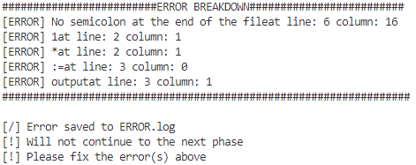
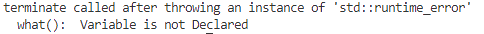

# HLInt-Interpreter

A Simple Interpreter Project from CS145-8L: Programming Languages Laboratory

## Supported Features

Here list the currently supported operation in the language.

### Declaration

There are only two supported data types currently.

* Integer
* Double
* String

You can declare them as follows:

```
x: integer;
y: double;
z: string;
```

### Assignmenet

The language also supports assignment operations.

```
x := 1 + 2 + 3;
y := x + 2;
```

Note: Assignment in string is currently not supported. To store information in it, you gonna do it using the `input` keyword.

### One-Way If

This also support one-way if statements and the following conditional operators:

* Equality (==)
* Greater than (>)
* Less than (<)
* Not Equal (!=)

```
if (x == y)
    output << x;
if (x != y)
    output << y;
```

### Output

You can also do output operation in the language.

```
output << x;
output << y;
output << x + y;
```

### Input

Input is now a supported operation

```
z: string;
input >> z;
output << z;
```

### Mathematical Evaluation

Evaluation of mathematical operation is support with the order of operation. Currently we support:

* Addition (+)
* Subtraction (-)
* Multiplication (*)
* Division (/)

```
output << x + ((y+3) + 4) - 10;
output << (10/2) + (3*8);
output << 10/(2+3)*8
output << 10/2*8
```

Note: There is currently no support on string operations

### Supported Literals

There are multiple literals that the language accepts:

* Integer Literal (1, 2,3 -5)
* Double Literal (1.23, 1.55, -1.22)
* String Literal ("watermelon", "papaya", "banana")

```
x = 1 + 2.23;
output << "watermelon";
```

### Error Feedback

The interpreter also has error feedback with (not so accurate) lines and columns depending on where the error is. Do take note that we start on line 0 and column 0.

Given the program:

```
x: integer;
y: double;
x := 1 * 2 + 3;
y := x + 2 output << x;
if (x == y) 
    output << z;
output<< x + y + 5;
output << "watermelon"
```


* Shows an error that you don't have a semicolon at the end of the file.
* Shows the error for the assignment at line 2 (3). However, it tells that it's in the column 1 (which is wrong).

    * This is an error because `*` is not yet supported
    * `1` is reported to be tthe problem, because the error was started there

* Shows an error at line 3 to be `:=`. Though the real error lies on the output part, it started at the assignment when evaluating it.

* Other errors such as the `output << z` will be detected and thrown on runtime since it's a `runtime error` such as this.

    